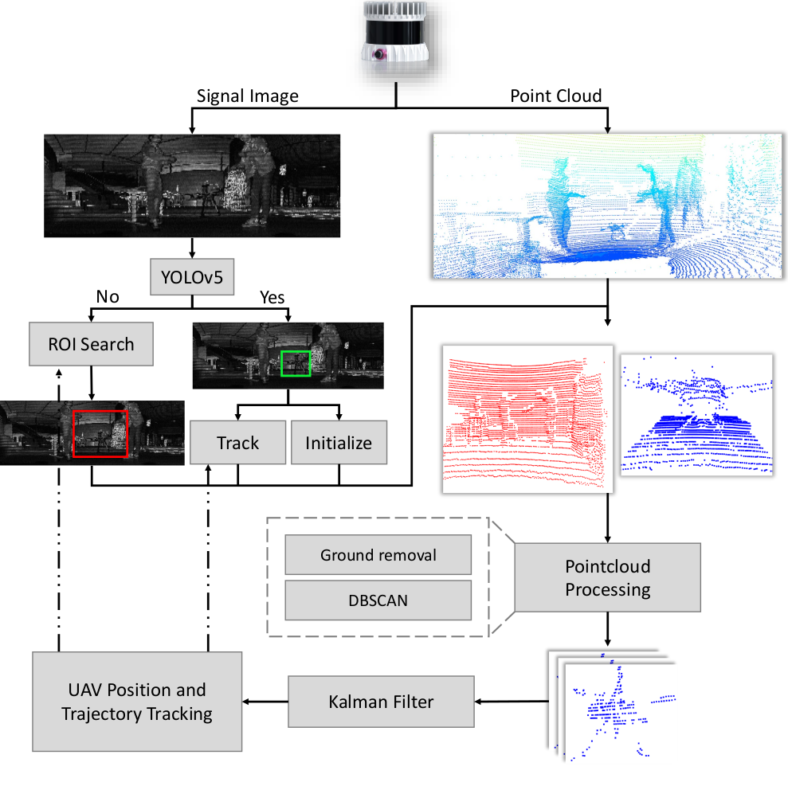
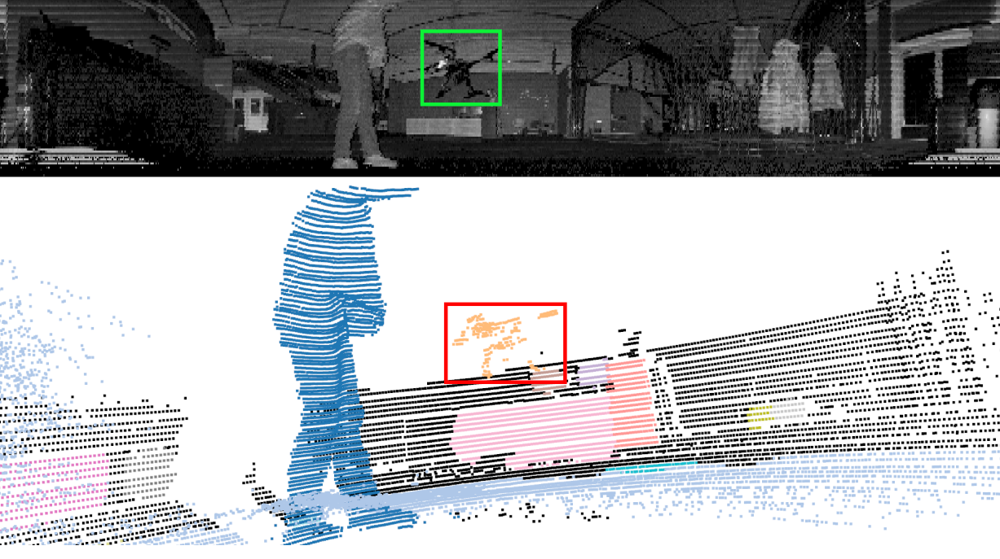
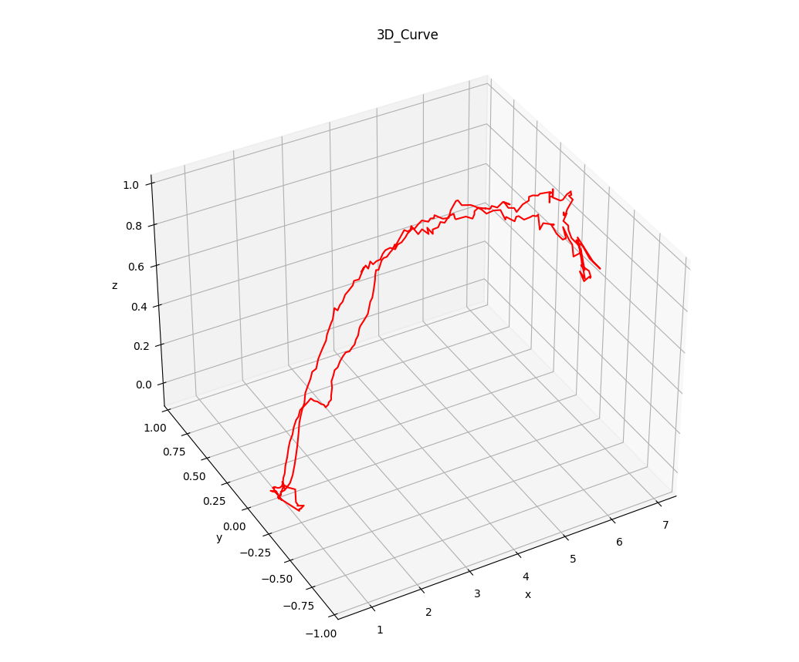
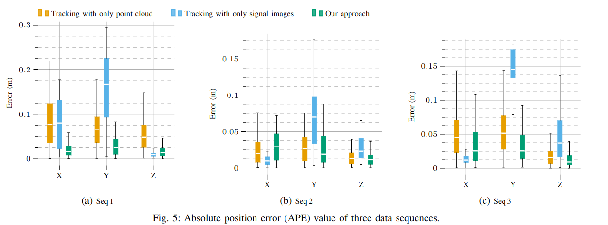
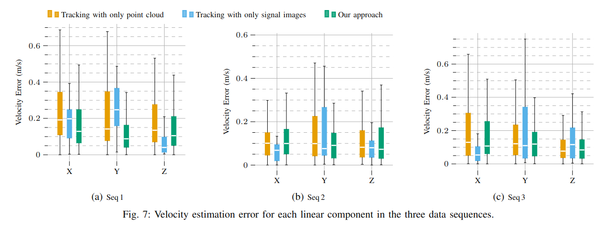

# UAV Tracking with Lidar as a Camera Sensors in GNSS-Denied Environments

## Abstract
In this paper, we are specifically interested in utilizing LiDARs and LiDAR-generated images for tracking Unmanned Aerial Vehicles (UAVs) in real- time which can benefit applications including docking, remote identification, or counter-UAV systems, among others. This is, to the best of our knowledge, the first work that explores the possibility of fusing the images and point cloud generated by a single LiDAR sensor to track a UAV without a priori known initialized position. We trained a custom YOLOv5 model for detecting UAVs based on the panoramic images collected in an indoor experiment arena with a MOCAP system. By integrating with the point cloud, we are able to continuously provide the position of the UAV. Our experiment demonstrated the effectiveness of the proposed UAV tracking approach compared with methods based only on point clouds or images. 

You can check our paper in  [arxiv](https://arxiv.org/abs/2303.00277) 
<div align=center>

</div>
<p align="center"> Diagram of proposed UAV tracking system based on the image
and point cloud generated by an Ouster LiDAR </p>
<div align=center>

</div>
<p align="center"> Example of a signal image (top) and its corresponding point
cloud with background removed (bottom). </p>


## Requirements

###  0. Python >=3.7  &  pip >19.0

### 1. Ouster sdk

   ```
   python3 -m pip install 'ouster-sdk[examples]'
   ```

### 2.  yolov5

   ```
   pip install yolov5
   ```

### 3. open3d

```
pip install open3d
```

### 4. Ros melodic

### 5. opencv
```
pip install opencv-python
```

## How to run

1. Download Ouster pcap frist
    [[pcap](https://drive.google.com/drive/folders/1Ds4X_oyU_fLYw02JkGmlM_VRx48BYSmx?usp=sharing) ]

2. Run the code

    ```
    python3 ouster_track.py
    ```

3. Use python scripts to validate

    ```
    python3 ./scrpits/plot_velo.py
    python3 ./scrpits/plot_error.py
    python3 plot_traj.py
    ```

   


## Experimental results

<div align=center>

</div>
<p align="center"> Apply YOLOV5 to the signal image to track UAV  and 3d plot of the final UAV trajectory</p>


## Traj & Velo validation 
<div align=center>

</div>
<div align=center>

</div>
